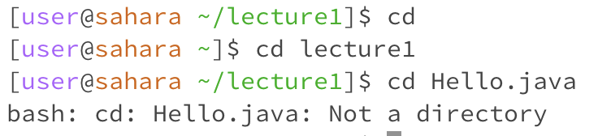
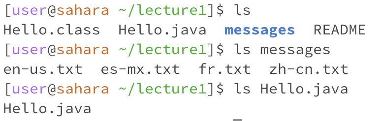
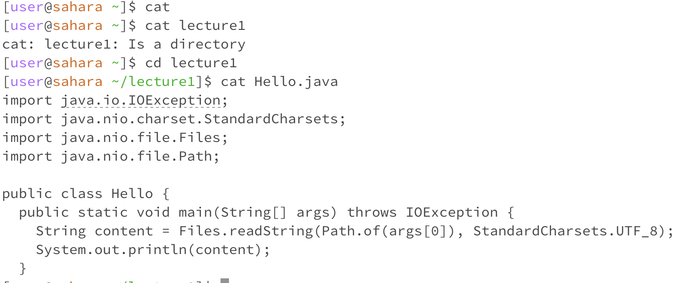

---
# Lab Report 1
---
## cd command

1. **No Argument:** The working directory when running the cd command with no argument is in /home/lecture1. When the cd command is entered with no arguments (only cd), the user is returned to the home directory. There were no errors when running this command.
2. **Directory as Argument:** The working directory when running the cd command with a directory as an argument was /home. In this case since "lecture1" was passed in as the argument, the user's working directory was changed back to /home/lecture1. This might be because the cd command changes the user's directory into the name of the directory that is passed in as an argument when running the command. There were no errors when running this command. 
3. **File as Argument:** The working directory when running the cd command with a file as an argument was /home/lecture1. When passing in "Hello.java" as an argument, the terminal returned an error indicating that "Hello.java" was not a directory. This might be because the cd command can only be used with directories as an argument and not with files.
\
## ls command

1. **No Argument:** The working directory when running the ls command with no argument is in /home/lecture1. When the ls command is run with no arguments (only ls), it listed all the files and subdirectories within the current working directory. In this case, since the working directory was in lecture1, it listed out the "Hello.class", "Hello.java", and "README" files, as well as the subdirectory "messages" which is highlighted in blue. There were no errors running this command.
2. **Directory as Argument:** The working directory when running the ls command with a directory as an argument was /home/lecture1. When the directory "messages" was passed in as an argument, the contents from within "messages" was printed in the terminal. This might be because the terminal combined the working directory /home/lecture1 withe the relative path /messages, following the absolute path /home/lecture1/messages and therefore printing out the contents from within the messages folder. There were no errors when running this command. 
3. **File as Argument:** The working directory when running the ls command with a file as an argument was /home/lecture1. When passing in "Hello.java" as an argument, the terminal printed out "Hello.java". Since "Hello.java" is a file itself, it does not contain any other directories or files, therefore causing the terminal to print out its own file name. There were no errors running this command.
\
## cat command

1. **No Argument:** The working directory when running the cat command with no argument (just cat) is in /home. Nothing happens because the terminal waits for the user's keyboard input. There were no errors when running this command.
2. **Directory as Argument:** The working directory when running the cat command with a directory as an argument was /home. When "lecture1" was passed in as an argument, the terminal indicated that "lecture1" was a directory. This might be because when using the cat command is meant to be used on files and not directories. In this case, since "lecture1" is a directory, the terminal reminds you that it is a directory and not a file.
3. **File as Argument:** The working directory when running the cat command with a file as an argument was /home/lecture1. When passing in "Hello.java" as an argument, the terminal printed out the contents inside "Hello.java". This is because the cat command displays the contents of whichever file name is passed in as an argument. There were no errors when running this command.

