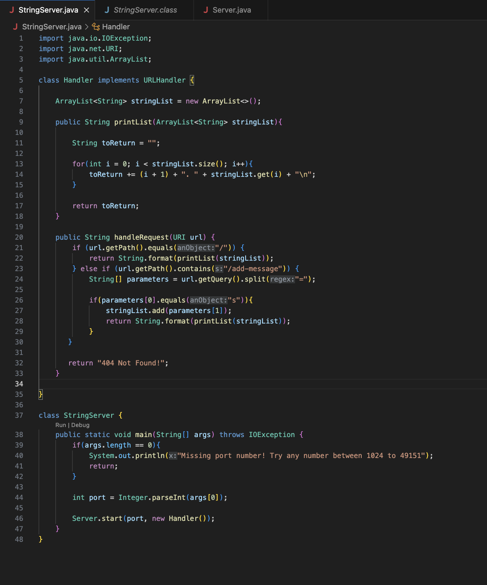
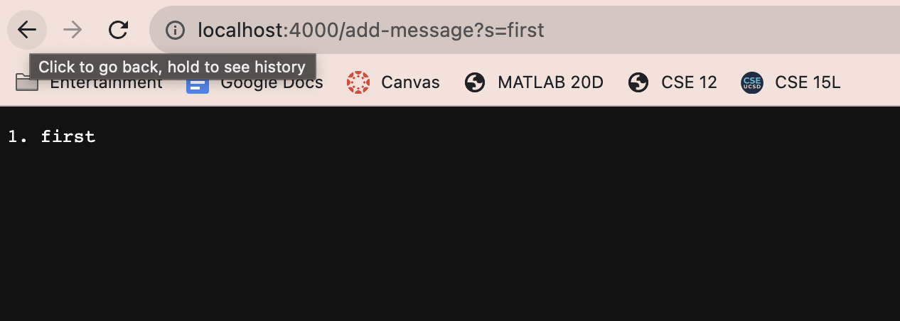
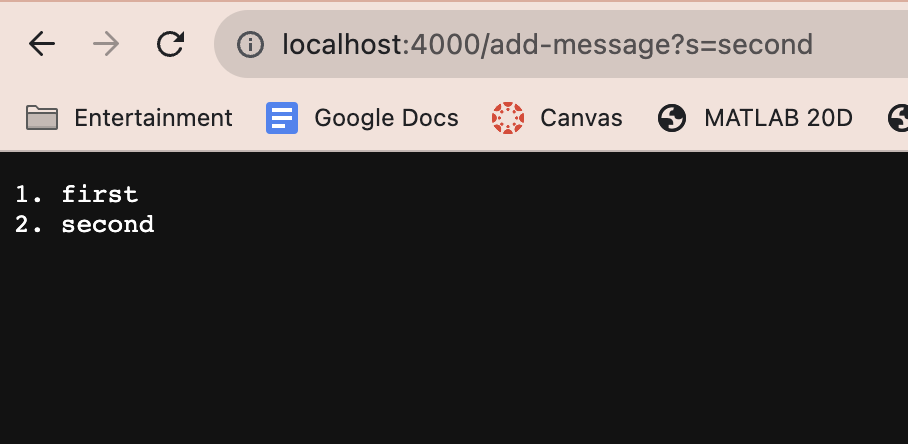
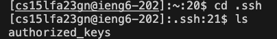
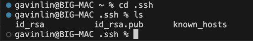

# Lab Report 2

## String Server Code

## Running String Server

After adding the query to the end of the url, the entire url is passed into the method "handleRequest" as an argument. Since the path contains "add-message", the code takes the query and splits the query into two, the word appearing before the equal sign and after the equal sign into an Array of Strings called "parameters". In the next if statement, the code checks that the word before the equals sign is "s", and if it is, then it adds the word after the equals sign (first), into the ArrayList field "stringList", which is then printed out by the method printList.

In the second screenshot, the url is passed into "handleRequest" once again, but the value after the equals sign is "second". Since the query is the same as in the first screenshot, "second" is added to the field "stringList" similarly to "first". "printList" is then called and formats the values stored inside "stringList", which now includes both "first" and "second" to display it in the format shown above.  

## Public & Private Keys

