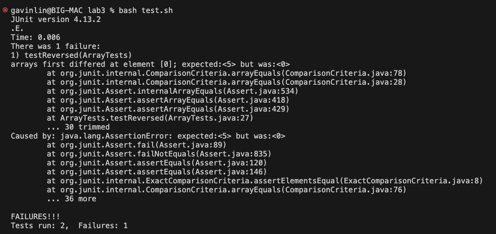

# Lab Report 3
## ArrayExamples Reversed Method
### Failure Inducing Input:
```
 @Test
 public void testReversed() {
    int[] input = {1, 2, 3, 4, 5};
    int[] output = ArrayExamples.reversed(input);
    assertArrayEquals(new int[]{5, 4, 3, 2, 1}, output);
 }
```

### Non-Failure Inducing Input:
```
@Test
public void testReversed2() {
  int[] input = {};
  int[] output = ArrayExamples.reversed(input);
  assertArrayEquals(new int[]{}, output);
}
```

### Symptoms


### Fixing the Bug

**Before:**
```
static int[] reversed(int[] arr) {
  int[] newArray = new int[arr.length];
  for(int i = 0; i < arr.length; i += 1) {
    arr[i] = newArray[arr.length - i - 1];
  }
  return arr;
}
```
**After:**
```
static int[] reversed(int[] arr) {
  int[] newArray = new int[arr.length];
  for(int i = 0; i < arr.length; i += 1) {
    newArray[i] = arr[arr.length - i - 1];
  }
  return newArray;
}
```

This fix works because in the previous buggy code, it was iterating through the elements of the empty newArray and storing those elements, 0, into the original array passed in as an argument. The fixed code iterates through the given array and stores it into the new array in reverse order.

## Researching Commands: find

### -links
   
I found this option using "man find" in the terminal.

```
gavinlin@BIG-MAC docsearch % find technical/government -links 1
technical/government/About_LSC/LegalServCorp_v_VelazquezSyllabus.txt
technical/government/About_LSC/Progress_report.txt
technical/government/About_LSC/Strategic_report.txt
technical/government/About_LSC/Comments_on_semiannual.txt
technical/government/About_LSC/Special_report_to_congress.txt
technical/government/About_LSC/CONFIG_STANDARDS.txt
technical/government/About_LSC/commission_report.txt
technical/government/About_LSC/LegalServCorp_v_VelazquezDissent.txt
technical/government/About_LSC/ONTARIO_LEGAL_AID_SERIES.txt
technical/government/About_LSC/LegalServCorp_v_VelazquezOpinion.txt
...
```
This command is finding all the files in government folder that has 1 link, this is useful because we may be interested in the content that the file is citing, and we can easily find all the files with links to other information.
```
gavinlin@BIG-MAC docsearch % find technical/plos -links 2
gavinlin@BIG-MAC docsearch % 
```
Similarly, this command is finding all the files in the plos folder that has 2 links. In this case, since nothing is returned, it is useful to know that none of the files in plos has 2 links and we should look elsewhere.

### -type

I found this option using "man find" in the terminal.

```
gavinlin@BIG-MAC docsearch % find technical -type d
technical
technical/government
technical/government/About_LSC
technical/government/Env_Prot_Agen
technical/government/Alcohol_Problems
technical/government/Gen_Account_Office
technical/government/Post_Rate_Comm
technical/government/Media
technical/plos
technical/biomed
technical/911report
```
This command finds and lists are the directory paths of technical. This is useful for if we didn't know the file structure and we wanted to set our directory into a subdirectory of technical.
```
gavinlin@BIG-MAC docsearch % find technical/biomed -type f  
technical/biomed/1472-6807-2-2.txt
technical/biomed/1471-2350-4-3.txt
technical/biomed/1471-2156-2-3.txt
technical/biomed/1471-2156-3-11.txt
technical/biomed/1471-2121-3-10.txt
technical/biomed/1471-2172-3-4.txt
technical/biomed/gb-2002-4-1-r2.txt
technical/biomed/gb-2003-4-6-r41.txt
technical/biomed/1471-2466-1-1.txt
technical/biomed/1471-2199-2-10.txt
technical/biomed/1471-2202-2-9.txt
technical/biomed/cc991.txt
...
```
This command finds and lists the everything in the biomed folder that is a file. This could be useful because if there were other subdirectories inside biomed and you only wanted the files, then it can act as a filer and only list out the files.

### -size

I found this option using "man find" in the terminal.

```
gavinlin@BIG-MAC docsearch % find technical -size +200
technical/government/About_LSC/commission_report.txt
technical/government/About_LSC/State_Planning_Report.txt
technical/government/Env_Prot_Agen/multi102902.txt
technical/government/Env_Prot_Agen/ctm4-10.txt
technical/government/Env_Prot_Agen/bill.txt
technical/government/Env_Prot_Agen/tech_adden.txt
technical/government/Gen_Account_Office/d0269g.txt
technical/government/Gen_Account_Office/GovernmentAuditingStandards_yb2002ed.txt
technical/government/Gen_Account_Office/Sept27-2002_d02966.txt
technical/government/Gen_Account_Office/d01376g.txt
technical/government/Gen_Account_Office/Statements_Feb28-1997_volume.txt
technical/government/Gen_Account_Office/pe1019.txt
technical/government/Gen_Account_Office/gg96118.txt
technical/government/Gen_Account_Office/d01591sp.txt
technical/government/Gen_Account_Office/im814.txt
technical/government/Gen_Account_Office/ai9868.txt
technical/government/Gen_Account_Office/May1998_ai98068.txt
technical/government/Gen_Account_Office/d02701.txt
technical/biomed/1471-2105-3-2.txt
technical/911report/chapter-13.4.txt
technical/911report/chapter-13.5.txt
technical/911report/chapter-13.2.txt
technical/911report/chapter-13.3.txt
technical/911report/chapter-3.txt
technical/911report/chapter-1.txt
technical/911report/chapter-6.txt
technical/911report/chapter-7.txt
technical/911report/chapter-9.txt
technical/911report/chapter-12.txt
```
This command finds and lists all the files and directories in technical that are more than 200 blocks large. This could be useful for finding a specific file that is very big, and you can filter out all of the smaller files.
```
gavinlin@BIG-MAC docsearch % find technical -type f -size -10
technical/government/Gen_Account_Office/d01121g.txt
technical/government/Media/Federal_agency.txt
technical/government/Media/water_fees.txt
technical/government/Media/balance_scales_of_justice.txt
technical/government/Media/BusinessWire2.txt
technical/government/Media/Funding_cuts_force.txt
technical/government/Media/Donald_Hilliker.txt
technical/government/Media/Free_legal_service.txt
technical/government/Media/Owning_a_Piece.txt
technical/government/Media/highlight_Senior_Day.txt
technical/government/Media/State_funding.txt
...
```
Similarly, this command finds and lists all the files (no directories since -type f is used) that are less than 10 blocks large. This is useful if you know there is a small file in a list of a lot of larger files that you want to filter out. 

### -newer

I found this option using "man find" in terminal.

```
gavinlin@BIG-MAC docsearch % find technical -newer newest.txt                       
gavinlin@BIG-MAC docsearch % 
```
In this command, I created an experimental file titled "newest.txt", and finding the all the files and directories in technical that are newer than "newest.txt", which is none of them in this case as "newest.txt" was just added. This could be useful if you add a new file into a subdirectory and can't remember where you put it, so you can find that path using an older file inside the directory. 

```
gavinlin@BIG-MAC docsearch % find technical/911report  -newer technical/911report/chapter-1.txt -size -50 -type f
technical/911report/preface.txt
```
This command is basically combining a lot of the previous options into one command, and looking for a file inside "911report" that is newer than chapter-1.txt and less than 50 blocks. This is useful as -newer can be combined with other options to create a larger filter if someone wanted to search more specifically for a file.


