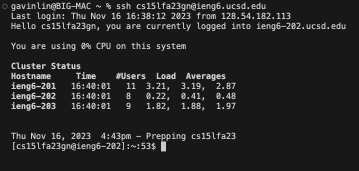
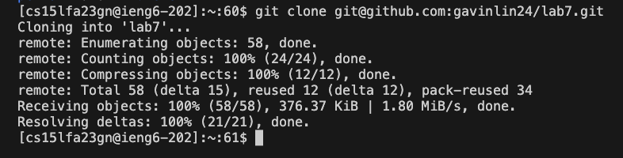
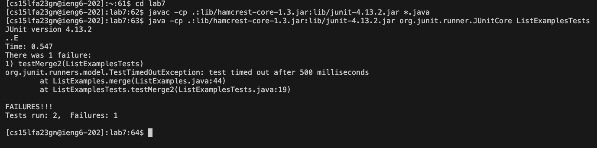
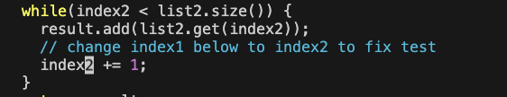
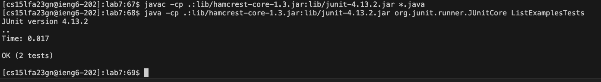
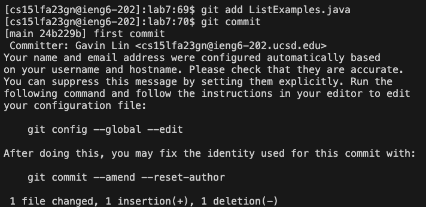
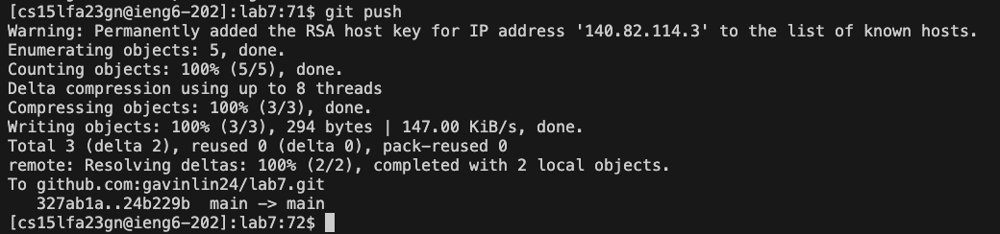

# Lab Report 4

## Step 4

_Keys pressed:_ ssh <kbd>Space</kbd> cs15lfa23gn@ieng6.ucsd.edu <kbd>Enter</kbd>

Here I use the ssh command followed by my ieng6 account information to log onto the remote server.

## Step 5

_Keys pressed:_ git <kbd>Space</kbd> clone <kbd>Space</kbd> git@github.com:gavinlin24/lab7.git <kbd>Enter</kbd>

Here I use the git clone command followed by the ssh github link to clone the lab7 repository onto the remote server. 

## Step 6

_Keys pressed:_ cd <kbd>Space</kbd> lab7 <kbd>Enter</kbd>, <kbd>Ctrl-R</kbd> javac <kbd>Enter</kbd>(The javac -cp .:lib/hamcrest-core-1.3.jar:lib/junit-4.13.2.jar *.java command was the first result in the search history), <kbd>Ctrl-R</kbd> java <kbd>Space</kbd> <kbd>Enter</kbd> (The java -cp .:lib/hamcrest-core-1.3.jar:lib/junit-4.13.2.jar org.junit.runner.JUnitCore ListExamplesTests was the first result in the search history)

Here I use cd to change my current directory into the lab7 folder. Then, I compile the files inside lab7 using javac -cp, and run the junit test file ListExamplesTests using java -cp. The command Ctrl+R is used to search for commands I used in the past. The result shows the test testMerge2 in ListExamplesTests is failing.

## Step 7

_Keys pressed:_ vim <kbd>Space</kbd> ListExamples.java <kbd>Enter</kbd>, 43 <kbd>down</kbd> e x i 2 <kbd>Esc</kbd> (the bug was 43 lines down, so typing 43 <kbd>down</kbd> moves the cursor 43 lines down. Pressing e moved the cursor to the end of the first word which happened to be the 1 at the word index1, x deleted the 1 in normal mode, i to get into insert mode and 2 to replace and fix the bug. Finally <kbd>Esc</kbd> to exit insert mode), :wq <kbd>Enter</kbd>

Here I use the vim command to open the file ListExamples.java on the remote server. I edited the the bug on line 43 by navigating the cursor down 43 times and moving it to the right until it was on the 1 on "index1". I then entered inser mode to change index1 to index2, and finally saved the file and exited back to the terminal using :wq. 

## Step 8

_Keys pressed:_ <kbd>Ctrl-R</kbd> javac <kbd>Enter</kbd> (same as step 6), <Ctrl-R> java <kbd>Space</kbd> <kbd>Enter</kbd> (same as step 6)

Here I repeated the commands used in step 6 to recompile the files after the bug was fixed, and ran the test file again. I used Ctrl+R again to autocomplete the commands I already ran in step 6. This time the results show that all the tests pass.

## Step 9

_Keys pressed:_ git <kbd>Space</kbd> add <kbd>Space</kbd> ListExamples.java, git commit <kbd>Enter</kbd>, i first commit <kbd>Esc</kbd> :wq <kbd>Enter</kbd> (The git commit command opened vim, so i to go into insert mode to add comment "first commit", <kbd>Esc</kbd> to exit insert mode and :wq to save), git <kbd>Space</kbd> push <kbd>Enter</kbd>

Here I added the ListExamples file, now fixed, using git add to prepare for a commit onto the github repository. I then use the git commit command to commit the file. Using git commit brings up vim in which I type a commit message "first commit" and use :wq to save the commit message. I then use git push to push the changes and upload it onto github.
