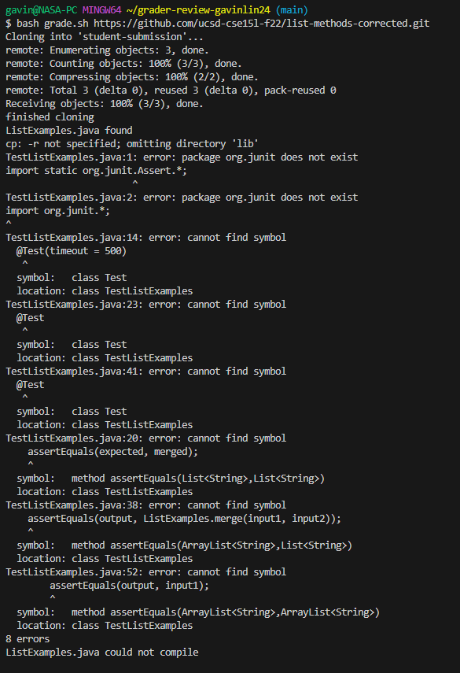
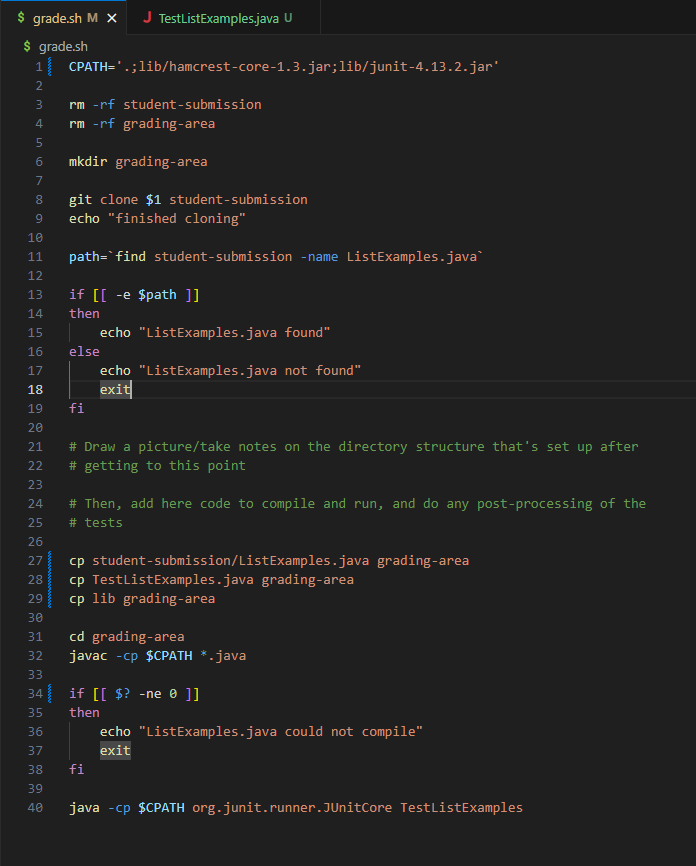
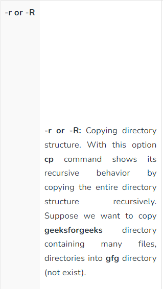
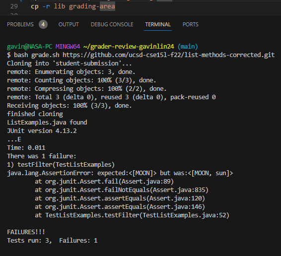
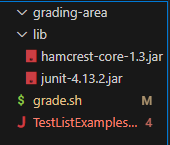

# Lab Report 5

## Student Question
I am having trouble compiling TestListExamples for my autograder. The error message in the terminal says the junit package doesn't exist, so I think there might be something wrong with copying the lib folder into student-submissions.



## TA Response
What options can be used with the cp command to copy a directory and its contents? Try doing a quick google search to see more options for cp.

## Information Received



**Note:** The student does a google search on options for cp commands and clicks on the first link (https://www.geeksforgeeks.org/cp-command-linux-examples/). Afterwards they change the bash script to include the -r option and runs the script again.

The bug here was not using the -r option after the cp command to copy the lib folder into student-submissions. Since lib is a directory and not a file, using the cp command without -r would not copy the contents inside lib, which contains the junit files needed to compile TestListExamples.

## Setup Information Needed
**file and directory structure:**


```
git clone https://github.com/gavinlin24/grader-review-gavinlin24.git
```

**grade.sh** (before fix)
```
CPATH='.;lib/hamcrest-core-1.3.jar;lib/junit-4.13.2.jar'

rm -rf student-submission
rm -rf grading-area

mkdir grading-area

git clone $1 student-submission
echo "finished cloning"

path=`find student-submission -name ListExamples.java`

if [[ -e $path ]]
then
    echo "ListExamples.java found"
else
    echo "ListExamples.java not found"
    exit
fi

# Draw a picture/take notes on the directory structure that's set up after
# getting to this point

# Then, add here code to compile and run, and do any post-processing of the
# tests

cp student-submission/ListExamples.java grading-area
cp TestListExamples.java grading-area
cp lib grading-area

cd grading-area
javac -cp $CPATH *.java

if [[ $? -ne 0 ]]
then
    echo "ListExamples.java could not compile"
    exit
fi

java -cp $CPATH org.junit.runner.JUnitCore TestListExamples
```

**TestListExamples.java**
```
import static org.junit.Assert.*;
import org.junit.*;
import java.util.Arrays;
import java.util.List;
import java.util.ArrayList;

class IsMoon implements StringChecker {
  public boolean checkString(String s) {
    return s.equalsIgnoreCase("moon");
  }
}

public class TestListExamples {
  @Test(timeout = 500)
  public void testMergeRightEnd() {
    List<String> left = Arrays.asList("a", "b", "c");
    List<String> right = Arrays.asList("a", "d");
    List<String> merged = ListExamples.merge(left, right);
    List<String> expected = Arrays.asList("a", "a", "b", "c", "d");
    assertEquals(expected, merged);
  }

  @Test
  public void testMerge(){
    ArrayList<String> input1 = new ArrayList<String>();
    ArrayList<String> input2 = new ArrayList<String>();
    input1.add("a");
    input1.add("d");
    input2.add("b");
    input2.add("c");

    ArrayList<String> output = new ArrayList<String>();
    output.add("a");
    output.add("b");
    output.add("c");
    output.add("d");

    assertEquals(output, ListExamples.merge(input1, input2));
  }

  @Test
  public void testFilter(){
        ArrayList<String> input1 = new ArrayList<String>();
        input1.add("MOON");
        input1.add("sun");
       
        ListExamples.filter(input1, new IsMoon());

        ArrayList<String> output = new ArrayList<String>();
        output.add("MOON");

        assertEquals(output, input1);


  }
}
```
**commands to trigger bug:**
```
bash grade.sh https://github.com/ucsd-cse15l-f22/list-methods-corrected.git
```
**fixing the bug:**

In the bash script, for the line where the student tries to copy lib into the student-submissions directory, add the -r option.
```
cp lib grading-area > cp -r lib grading-area
```
## Reflection
There were many things I learned that I didn't know before, including editing files in vim, using a debugger like jdb, and writing bash scripts to automate processes. I think overall I gained skills that are useful for saving me a lot of time in the future on programming assignments.
